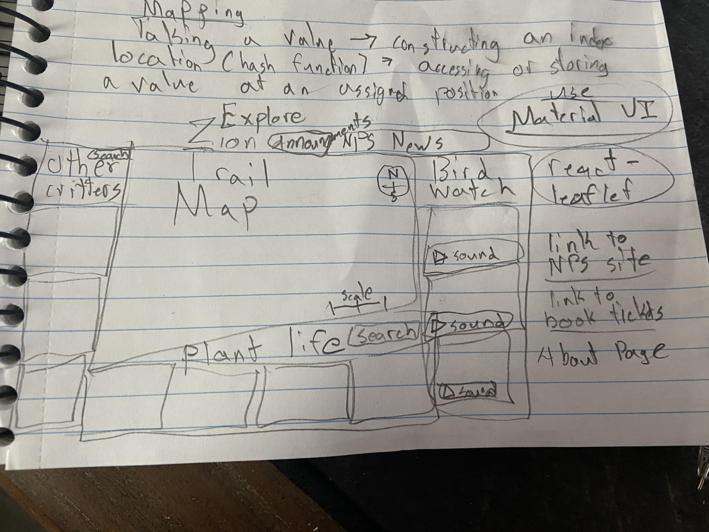

### Project Explore Zion

### Description
The goal of this project is to provide user with a  multitude of vegetation data on a map, a glossary to look up vegetation species across the national park, along with common birds and animals they are likely to encounter when visiting. This is made for biology lovers and bird watchers, and for people who just love reading about nature and studying the flora and fauna!

### What I plan to integrate
- A MERN stack application
- Main map display will contain huge datasets for vegetation species (currently I have 76 different colors for each plant species), possibly adding more data plots to include important features
- A NPS API that displays news, updates, alerts for the Zion Park area as well as events happening and upcoming
- IQair Air quality and weather API to display 
- Static media, audio recordings of bird calls and high quality images  initially pulled from xeno-canto API to display the most common birds you will likely encounter
-an About page that goes into detail of how to navigate the map and when the best time of year to go to the park and planning in advance
- info (and potentionally audio calls) of other critters and animals you will likely encounter in the park
- info about the plants you will encounter including information about the plant species, family, genus, edibility and toxicity, etc

### Stack
- MERN stack (potentially using amazon AWS to store large files and having mongoDB reference the said Amazon database)

### Learning Goals
- Get more familiar with MERN and front end (most of the data will be static)
- get more familiar with geoJSON data and geospatial data using react-leaflet, QGIS program to view and understand the data

### Wireframe

#### Mock-up
--- 

---
 #### Proof-of-concept
 
 - Testing to get different colors for each vegetation name
 
 
